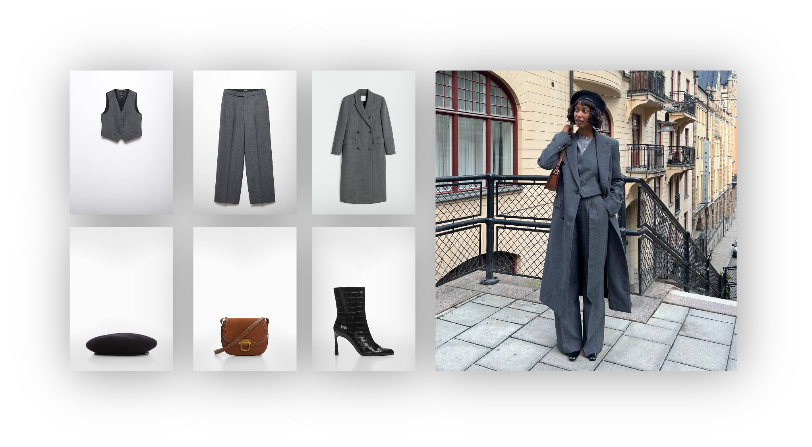

# UPC Datathon 2023
# Fashion Compatibility Challenge 

## Overview

This challenge aims to create a model capable of generating outfit recommendations based on a given initial product. Fashion matching is complex due to the nuanced patterns and visual details that dictate whether products pair well together, often going beyond mere product metadata. For instance, it's not straightforward to determine if a violet satin dress, white sandals, and a silver chic bag make a good outfit without seeing the items.
 
The essence of a good outfit often lies in the complementary nature of different products rather than their similarity. The task here is to extract and model these visual features to predict matching products effectively. One approach to address this is the "Fill in the Blank" task, where the goal is to predict a missing item in a given outfit from a list of candidate products. This task serves as a stepping stone towards generating complete outfits from a single product. However, participants are encouraged to explore other innovative solutions to this challenge as well.
 
Participants will have the opportunity to work with real outfits curated by stylists and fashion experts at MANGO and exhibit their proficiency in navigating a software development environment while adhering to strict deadlines and maintaining performance under a high-pressure scenario.

## Project
This project is based on create a app (https://mangodatathon2023.streamlit.app/) that shows new outfits based on the known outfits that mango consider has good. The idea is that when the user picks a clothes we show appropiate outfits that match with this clothes.

## Code 
   /dataset: Have the base dataset need for run the code. Need to add the images that you can find in the zip.
   /src/Data_generator.ipynb: Have the code to preprocess the data
   /src/Main.ipynb: Have the code that load the pickle and the data and shows outfits and recomendations base on it.
   /src/generate_oufits.py: Have the code of the functions which create more outfits and the find the recomendations based on the graph
   /src/my_graph.pickle: Have the pickle which has the graph of the outfits
   /src/outfit_cleaning.py: Have the preprocessing functions
   /src/show_oimages.py: Have the preprocessing functions for show single clothes or full outfits
   /src/outfit.csv: have the final outfits that we have created.

